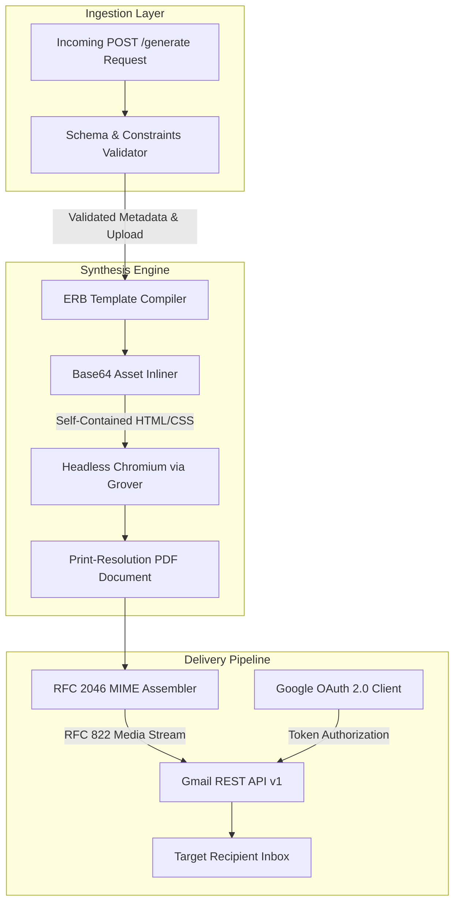

# Send an Owl - Generation and Dispatch Engine

The Send an Owl Generation and Dispatch Engine is a specialized backend microservice responsible for document synthesis, print-resolution PDF compilation, and authenticated email delivery.

The service ingests card metadata and photograph uploads from client applications, dynamically renders customized card artwork using web standards, compiles the layout into a print-ready PDF, and dispatches the card through Google's Gmail REST API.

---

## Architecture



---

## Processing Pipeline

### 1. Request Validation and Ingestion
Each card creation request is validated against strict constraints before processing begins:
- Template identifier matching supported themes (`classic`)
- Recipient and sender character boundaries
- Recipient email address RFC syntax
- Word count boundaries on personalized greetings (50 words maximum)
- Image format validation (JPEG, PNG, WebP, GIF) and payload size enforcement (5 MB ceiling)

### 2. High-Fidelity Print Synthesis
Card designs are authored in HTML5 and CSS3, utilizing Google Fonts (`Dancing Script` and `Inter`) and high-resolution background assets. The engine:
- Compiles the template using Ruby ERB.
- Inlines both background textures and user-uploaded photographs as Base64 data URIs to produce completely self-contained documents.
- Uses Grover to drive headless Chromium in a sandboxed viewport, generating a crisp 600x800 px card formatted for high-density printing.

### 3. MIME Structure and Deliverability
To ensure maximum deliverability and prevent email clients from misidentifying or suppressing binary attachments, the engine constructs a strict RFC 2046 nested MIME hierarchy:

```text
Content-Type: multipart/mixed
│
├── Content-Type: multipart/alternative
│   ├── Content-Type: text/plain; charset=UTF-8
│   └── Content-Type: text/html; charset=UTF-8
│
└── Content-Type: application/pdf
    Content-Disposition: attachment; filename="birthday-card.pdf"
```

- Body text and responsive HTML formatting are packaged inside `multipart/alternative`.
- The PDF document is attached at the root `multipart/mixed` level with explicit content disposition.
- The `Message-ID` header is pinned to a valid domain (`@mail.gmail.com`) to prevent container-generated hostname flags.
- Sender addresses are formatted using RFC 2822 standard display names.

### 4. Direct Media Stream Dispatch
Rather than base64-encoding the entire multipart message into a JSON string—which introduces severe memory overhead and payload limits—the engine streams raw RFC 822 data directly to Google's media upload endpoint (`/upload/gmail/v1/users/me/messages/send`).

---

## Service Endpoints

### Health and Readiness Probe
```http
GET /
```
- **Purpose:** Used by client applications and load balancers to verify service availability and trigger background warm-up on sleep-enabled container platforms.
- **Output:** JSON object detailing service name, operational status, and a readiness confirmation message.

### Card Generation and Delivery
```http
POST /generate
```
- **Content-Type:** `multipart/form-data`
- **Fields:**
  - `template`: Template identifier (`classic`)
  - `recipientName`: Full name of recipient (1-60 characters)
  - `recipientEmail`: Valid email address of recipient
  - `senderName`: Full name of sender (1-60 characters)
  - `message`: Personal card message (max 50 words)
  - `photo`: Binary image attachment (max 5 MB)
- **Responses:**
  - `200 OK`: Card generated and queued for delivery.
  - `422 Unprocessable Entity`: Input failed validation schema.
  - `503 Service Unavailable`: OAuth credentials unconfigured.
  - `500 Internal Server Error`: Generation or dispatch fault.

---

## Ephemeral Lifecycle and Privacy

The engine operates on a strictly ephemeral model:
- No user content, names, messages, or photographs are written to a persistent database.
- Uploaded images and rendered PDF files are written to a transient directory with unique random identifiers.
- A mandatory cleanup block guarantees that all temporary image and PDF artifacts are purged from the filesystem immediately after dispatch, whether the operation succeeds or encounters an exception.

---

## Technical Stack

- **Application Server:** Ruby 3.3, Sinatra 4.0, Puma 6.4
- **PDF Compilation Engine:** Grover 1.1 with Node.js 22 LTS and Headless Chromium
- **API and Authentication:** Google APIs Client (`google-apis-gmail_v1`), `googleauth`
- **Email Standards:** Ruby `mail` gem (RFC 2046, RFC 2822, RFC 5322 compliance)
